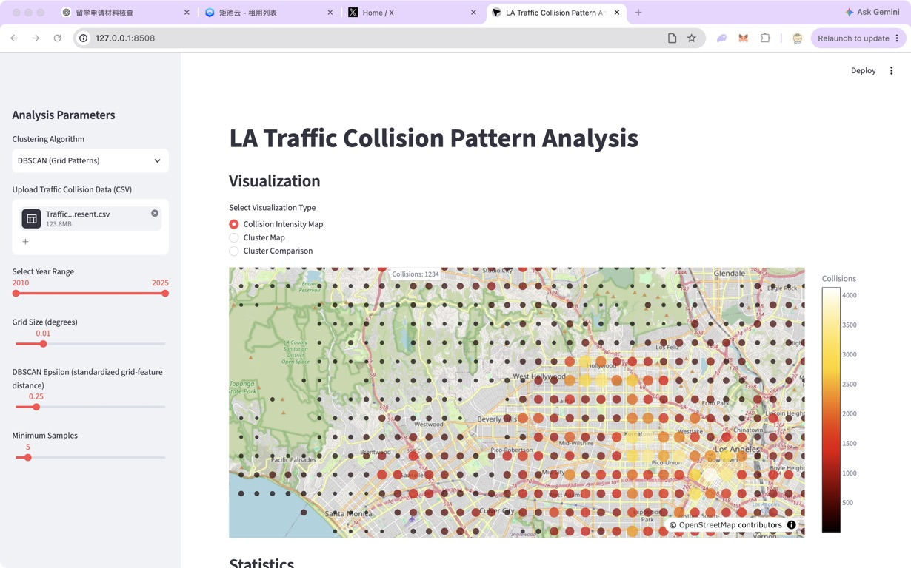

# LA Traffic Collision Pattern Analysis

Coursework-scale exploratory analysis of Los Angeles traffic-collision records.
It provides a Streamlit interface, reusable preprocessing and clustering
modules, a synthetic test fixture, and a documented reproduction on a fresh
official dataset snapshot.

## Overview

The interface supports preprocessing, grid aggregation, DBSCAN grid-pattern
analysis, record-level K-Means pattern analysis, and parameter controls. The
image below is a real Streamlit session using the official 2026 snapshot.



## Dataset

The reproducible 2026 analysis uses *Traffic Collision Data from 2010 to
Present* from Los Angeles Open Data, downloaded on 2026-09-08. The fresh
official snapshot has 621,677 raw records; current preprocessing retains
614,812 records (1.104% removed during coordinate/date validation).

The 124 MB source CSV is intentionally not in this repository. It is a fresh
2026 snapshot, not the original 2025 coursework input; therefore its results
must not be presented as a reproduction of the archived 2025 figures.

## Interactive Analysis

Run the original Streamlit interface locally:

```sh
streamlit run app.py
```

The 2026 validation used the complete fresh official snapshot in the interface.

## Analysis Pipeline

```text
CSV -> coordinate/date validation -> temporal and descriptive age features
    -> grid aggregation or record-level features -> clustering -> visualization
```

## DBSCAN Grid Patterns

DBSCAN operates on **grid cells**, not individual records. Each cell uses a
standardized accident count and weekend ratio, plus standardized grid latitude
and longitude with the existing 0.5 spatial weight. `eps` is therefore a
standardized mixed feature-space distance, not a geographic radius.

The exploratory default is grid size `0.01`, `eps=0.25`, and
`min_samples=5`. It was selected as a balanced point in the full-data sweep,
not as a universal or optimal parameter choice. Age group and peak hour remain
available in summaries but are deliberately excluded from the DBSCAN distance:
the former would impose ordinal spacing, while the latter is circular.

## K-Means Record Patterns

The main K-Means interface clusters **individual collision records** using
cyclical hour and weekday encodings, median-imputed victim age with a missing
age flag, and one-hot victim sex and descent. Premise description remains a
descriptive field rather than a high-dimensional distance block. It describes
temporal and demographic record patterns, not spatial zones. On the 2026
snapshot, K=2 has the highest deterministic 20,000-record sampled silhouette;
the sweep does not identify a strong multi-cluster optimum. K=4 and K=8 are
representative exploratory granularities.

## Compare Mode

Compare mode runs DBSCAN and K-Means on the same grid-level feature matrix and
shows a grid-cell crosstab. It is a descriptive overlap view, not a direct
algorithm-agreement or quality score; it is distinct from the record-level
K-Means analysis above.

## Parameter Sensitivity

The complete full-data tables and methodology notes are in
[`experiments/2026-official-snapshot/`](experiments/2026-official-snapshot/).

| Setting | Grid cells | Clusters | Noise cells | Interpretation |
| --- | ---: | ---: | ---: | --- |
| Grid 0.005, eps 0.25 | 4,339 | 19 | 424 (9.77%) | Fine local detail |
| Grid 0.01, eps 0.25 | 1,314 | 20 | 376 (28.61%) | Balanced exploratory view |
| Grid 0.02, eps 0.25 | 401 | 14 | 261 (65.09%) | Coarser smoothing |

At grid size 0.01 and `min_samples=5`, low epsilon (0.02--0.08) produces all
noise; `eps=0.25` retains multiple clusters and noise; high epsilon (>=0.50)
merges the cells into two large groups. These are clustering-behaviour results,
not causal claims about traffic safety.

| Epsilon | Clusters | Noise cells |
| ---: | ---: | ---: |
| 0.10 | 1 | 1,309 (99.62%) |
| 0.20 | 39 | 760 (57.84%) |
| 0.25 | 20 | 376 (28.61%) |
| 0.30 | 12 | 198 (15.07%) |
| 0.50 | 2 | 30 (2.28%) |

| K | Sampled silhouette |
| ---: | ---: |
| 2 | 0.2320 |
| 4 | 0.1488 |
| 8 | 0.1419 |
| 20 | 0.1438 |

Detailed, final full-data tables: [grid sweep](experiments/2026-official-snapshot/final_grid_sweep.csv),
[epsilon sweep](experiments/2026-official-snapshot/final_dbscan_eps_sweep.csv),
[minimum-samples sweep](experiments/2026-official-snapshot/final_min_samples_sweep.csv),
and [K-Means sweep](experiments/2026-official-snapshot/final_kmeans_sweep.csv).

## Reproducibility

`examples/sample_collisions.csv` is a small synthetic fixture for automated
tests and the CLI; it is not LA Open Data.

```sh
python run_analysis.py examples/sample_collisions.csv
pytest
```

The fixture currently yields 13 input rows, 8 processed rows, 4 grid cells, and
2 K-Means clusters. Tests cover parsing, validation, feature generation,
clustering, the CLI, and the Streamlit parameter safeguards.

## Archived 2025 Coursework Outputs

The PNG files in [`DemoPics/`](DemoPics/) are retained historical coursework
outputs from the original 2025 repository history. They are archived examples,
not outputs of the 2026 fresh-snapshot reproduction.

## Method Notes and Limitations

- The current official snapshot differs from the original coursework data.
- Grid size, epsilon, and minimum samples materially affect grouping.
- Clustering identifies exploratory patterns; it does not establish causes,
  rank neighborhood risk, or justify policy interventions.
