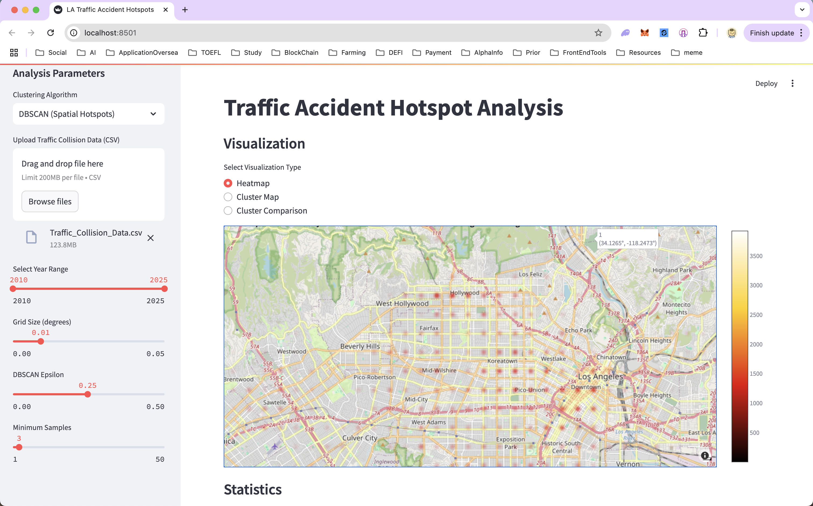

# Traffic Collision Data Mining

Coursework project for exploratory analysis of Los Angeles traffic-collision data.

## Overview

The project includes CSV preprocessing, coordinate parsing, date/time handling, age-group features, spatial grid aggregation, K-Means and DBSCAN clustering, and Folium/Plotly visualization modules. It uses library implementations of the clustering algorithms.

## Pipeline

```text
CSV -> preprocessing -> valid LA coordinates -> temporal and age-group features -> grid aggregation -> clustering -> visualization or summary
```

## Current reproducible example

`examples/sample_collisions.csv` is a small synthetic fixture for validating the pipeline, tests, and CLI demonstration. It is not the historical LA dataset.

```sh
python run_analysis.py examples/sample_collisions.csv
```

Current output:

```text
Input rows: 13
Processed rows: 8
Grid cells: 4
Clusters: 2
```

## Tests

```sh
pytest
```

Tests cover location parsing, coordinate filtering, date/time parsing, age-group features, grid aggregation, K-Means, DBSCAN, malformed input, and the CLI.

## Historical results

The PNG files in `DemoPics/` are historical outputs retained from the original coursework project.



## Dataset

The original historical dataset is not included. The project used *Traffic Collision Data from 2010 to Present* from Los Angeles Open Data.

## Limitations

The included fixture is synthetic, while the archived figures depend on the original dataset. Clustering is exploratory coursework analysis.

## Historical interface

`app.py` is the original Streamlit interface retained from the 2025 repository history. It imports the same preprocessing, clustering, and visualization modules documented above.
