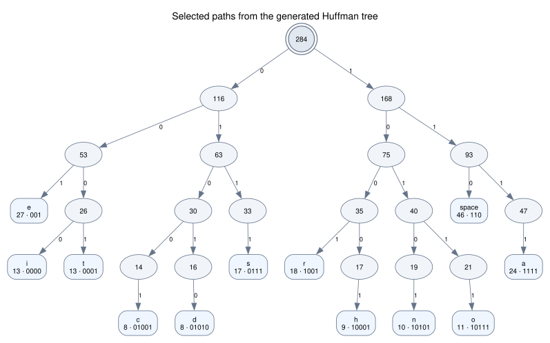

# Huffman Coding & Decoding

This started as one of my Data Structures / Algorithms course projects in 2023. The original assignment focused on building a Huffman tree and generating codes from it.

## Example

For this demo, I used a short social-media post as the input:

<p align="center">
  
</p>

The input contains **282 characters and 284 UTF-8 bytes**. Since the implementation works at the byte level, multi-byte UTF-8 characters are encoded as their individual bytes.

For this input, the generated Huffman code table gives the following payload sizes:

| Metric | Result |
| --- | ---: |
| Input size | 284 bytes |
| Fixed-width baseline | 2,272 bits |
| Huffman payload | **1,316 bits** |
| Theoretical packed payload | **165 bytes** |
| Bits saved | **956 bits** |
| Payload reduction | **42.1%** |

The packed size excludes the Huffman tree/codebook and other file-format metadata.

```text
Round-trip: PASS
Code-table equivalence: PASS
```

## Huffman tree

Huffman coding assigns shorter codes to more frequent bytes and longer codes to rarer ones.



For example, `space` appears 46 times and `e` appears 27 times, so both receive 3-bit codes. The figure shows selected paths from the same complete 46-leaf tree used by the encoder.

[View the complete 46-leaf tree](demo/trump-post-tree.svg)

## How it works

The implementation first counts the frequency of each byte, then repeatedly combines the two lowest-frequency nodes until a single Huffman tree remains.

Each left edge contributes `0` and each right edge contributes `1`, giving every leaf a prefix-free code. Encoding replaces each byte with its code; decoding walks the same tree and reconstructs the original bytes.

Equal-frequency nodes use deterministic tie-breaking so the same input produces the same code table and visualization.

## Two ways to generate the codes

The top-down implementation uses DFS from the root, appending `0` for a left edge and `1` for a right edge.

I also implemented the reverse approach: starting from each leaf, the bottom-up version follows parent links back to the root, records each edge, and reverses the resulting path.

The program checks that both methods produce the same code table.

## Running locally

```bash
make
./huffman examples/trump.txt
```

Generate the visualizations with Graphviz:

Graphviz is only required for generating the SVG visualizations.

```bash
make demo/trump-post-tree.svg
make demo/trump-post-tree-overview.svg
```

Run the tests:

```bash
make test
make sanitize
```

## Notes

The implementation supports byte values `0–255`. The encoded stream is kept as a readable `0`/`1` string, so the reported 1,316 bits are the logical Huffman payload rather than the in-memory string size or a complete compressed-file size.

A real file format would also need to store the tree/codebook, metadata, and bit padding.
