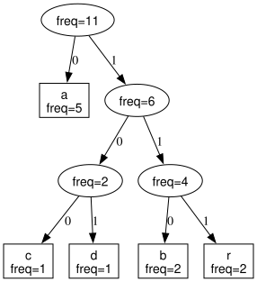

# Huffman Coding & Decoding

Originally developed as a Data Structures / Algorithms coursework project in 2023 and revisited in 2026 to complete decoding, strengthen correctness tests, and improve the implementation.

## Overview

- Byte-frequency counting and deterministic Huffman tree construction
- Top-down DFS and bottom-up parent-traversal code generation
- Encoding to a readable `0`/`1` bit string and decoding back to bytes
- Round-trip, error-path, and sanitizer validation

## Build and run

```sh
make
./huffman examples/abracadabra.txt
```

## Test

```sh
make test
make sanitize
```

## Example

The `abracadabra` example produces a frequency/code table, encoded bits, decoded text, and these checks:

```text
Round-trip: PASS
Code-table equivalence: PASS
```

## Visualization

```sh
make demo/tree.svg
```



Edge `0` is the left child and edge `1` is the right child.

## Notes

The core API supports byte values `0–255`. The CLI is a readable text demonstration; this coursework-scale implementation does not define a production compression-file format.
