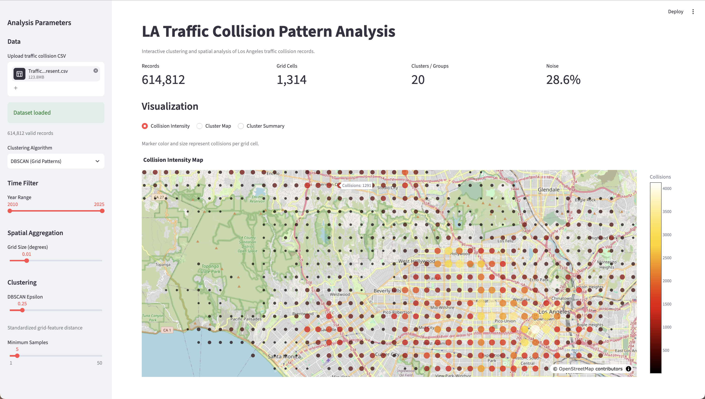
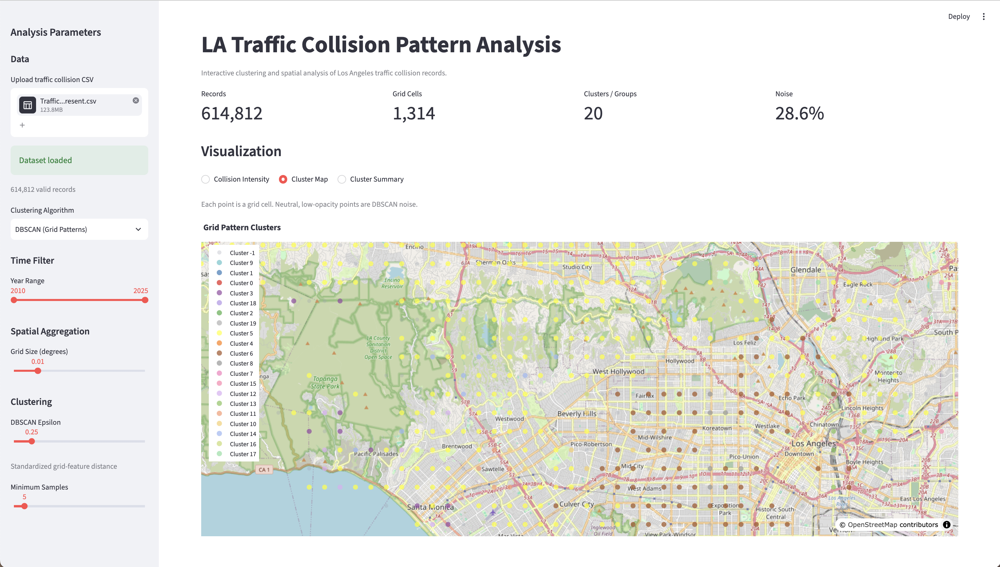
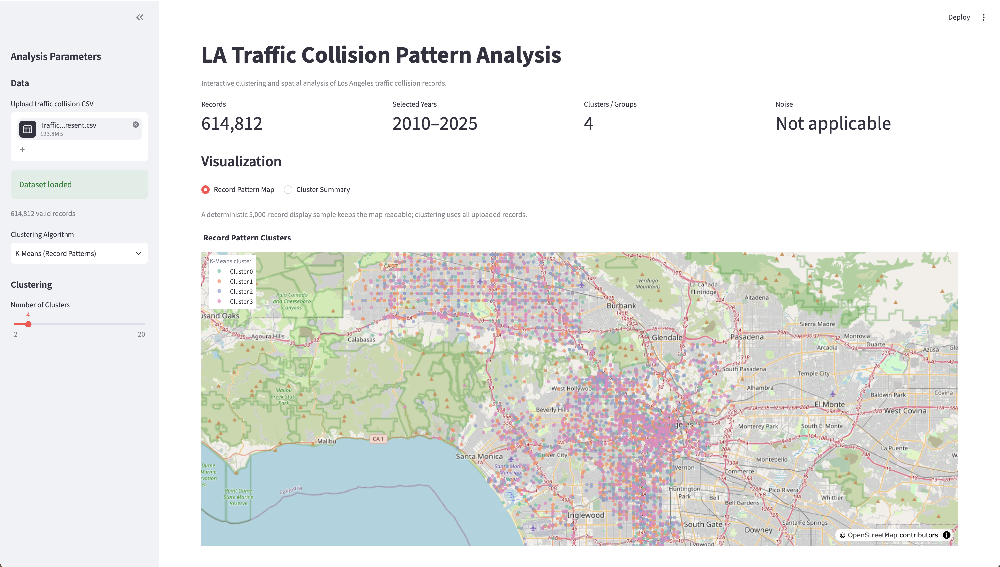

# LA Traffic Collision Pattern Analysis

This project started as a Data Mining course assignment using Los Angeles traffic collision data. I built a pipeline for cleaning the records, aggregating collisions into spatial grids, comparing clustering methods, and exploring the results through a Streamlit interface.



## What I worked on

Most of the project is split between data preparation and two different clustering views:

- **Data preparation** for parsing coordinates and occurrence time, filtering invalid records, and building the features used by the analysis.
- **DBSCAN grid patterns** for grouping spatial grid cells using collision volume, weekend ratio, and weighted coordinates.
- **K-Means record patterns** for exploring temporal and demographic differences between individual collision records.
- **Streamlit interface** for changing the year range and clustering settings and viewing the results interactively.

## What I found

### Area

**77th Street had the largest raw collision-record count with 41,749 records (6.8%)**, followed by Southwest, Wilshire, Olympic, and Newton.

| Area | Records | Share |
| --- | ---: | ---: |
| 77th Street | 41,749 | 6.8% |
| Southwest | 36,357 | 5.9% |
| Wilshire | 34,601 | 5.6% |
| Olympic | 32,410 | 5.3% |
| Newton | 32,333 | 5.3% |

These are raw record counts rather than exposure-adjusted risk rankings.

### Time

**17:00 was the highest-count hour with 41,369 records (6.7%)**, followed closely by 15:00 and 18:00.

**Friday had the highest count among the seven days of the week**, with 97,155 records.

### Age

Among records with a valid victim age, **25–34 was the largest age group**, with 140,288 records, or 26.6% of valid-age records. The median valid victim age was 38.

## DBSCAN grid patterns

The spatial view aggregates individual records into grid cells and then applies DBSCAN.

With a `0.01°` grid, I use `eps=0.25` and `min_samples=5` as the current exploratory setting. This produces **1,314 grid cells**, **20 non-noise groups**, and **28.6% noise** on the full validated snapshot.



I tried several nearby settings as well. Smaller `eps` values fragmented the grid heavily and left much more noise, while larger values merged most cells into a few broad groups. I kept `eps=0.25` and `min_samples=5` as a useful middle ground for exploring the data.

## K-Means record patterns

The K-Means view works at the individual-record level. It uses cyclical time features together with victim age and categorical sex/descent features, while location is not part of the clustering distance.



The map shows the groups mixed across the city, which is consistent with location not being part of the clustering distance. Their differences are easier to see in the record profiles.

In the current K=4 exploratory view, one group has a modal hour around **08:00**, a median valid age of **41**, and a weekend share of about **13.9%**. Another has a modal hour around **23:00**, a median valid age of **34**, and a weekend share of about **47.9%**.

I found that the missing-age flag was strong enough to form a cluster mostly around missing data, so I removed it from the clustering distance.

The sampled silhouette scores were close across the tested values of `K`; K=10 was slightly highest at 0.1472. I use K=4 in the demo because it gives a clearer multi-group view, not because it is optimal.

## Data

This project uses LAPD's **[Traffic Collision Data from 2010 to Present](https://data.lacity.org/w/d5tf-ez2w/ir6t-6fx6)** from the Los Angeles Open Data Portal.

Download the CSV from the official dataset page and upload it through the Streamlit sidebar.

## Running locally

Create a virtual environment and install the dependencies:
```bash
python3 -m venv .venv
source .venv/bin/activate
python3 -m pip install -r requirements.txt
```

Start the Streamlit interface:
```bash
streamlit run app.py
```

Then upload a compatible LA traffic collision CSV from the sidebar.

For a quick local run:
```bash
python3 run_analysis.py examples/sample_collisions.csv
```

Run the tests with:
```bash
pytest tests -q
```

## Notes

These are exploratory patterns in the records, not exposure-adjusted risk estimates. I do not use them as neighborhood safety rankings, causal explanations, or collision-risk predictions.
